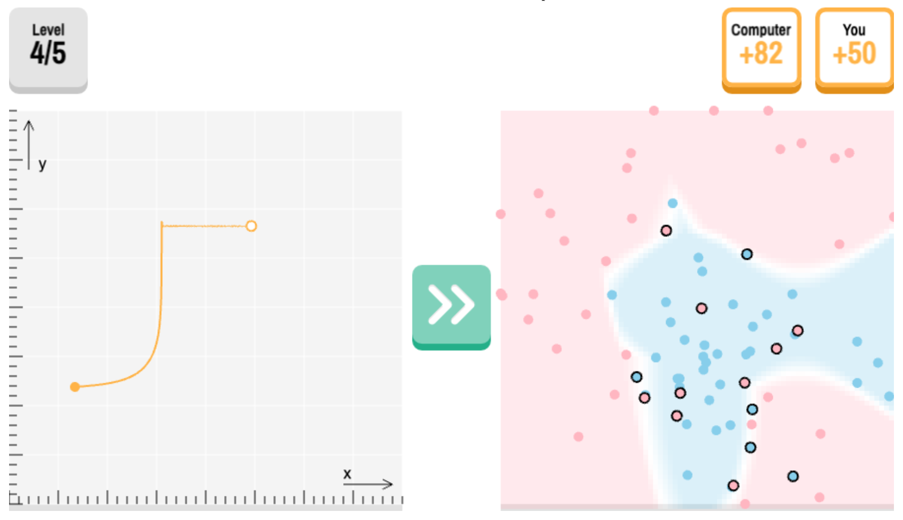

# 🎮 Min Sweeper

[Play here!](https://felixomahony.github.io)

  

This game is a bit like mine sweeper, but instead of trying to find mines, the player tries to find neural network parameters (x and y) which minimise the loss of a network for a classification problem (between pink and blue datapoints). The player competes against a computer which is using gradient descent for the same task.

## Stack
The game is made with `Phaser.js`, although a [frontend](https://felixomahony.github.io) uses `React.js` as a wrapper.

The game's assets are bundled with `webpack`. Bear this in mind if you fork this code, as each deployment requires a rebuild.

The data used in this game was generated with `numpy` in `Python` and the networks were trained using `Pytorch`

## Code
The main code for gameplay can be found in `./game.js`. The code for generating data and networks for each level may be found in the directory `./generate_levels/`.

### game.js
This is a simple all-phaser script. Each level is separated into a separate phaser scene, while the rendering of each level is done using common global functions (taking different parameters). Two additional scenes, introduction and end, render the two slides at the start and the end.

There is some gradient descent in `game.js` within the function `gradient()`. However, most of the true machine learning is done in `generate_levels/`.

### generate_levels/
These are the scripts which generate the data for the levels and train the networks which the user goes on to select parameters for. Note that the user only chooses two parameters, the other 51 are pre-trained values.

There are three files within `generate_levels/`. The first, `generate_data.py` generates the data for each of the levels. The idea is that the levels should get harder each time, with the first level being easiest and the final being the hardest.

`network.py` contains all the `Pytorch` methods for training the neural networks. The networks are created, trained, and output to json files for rendering in `game.js`.